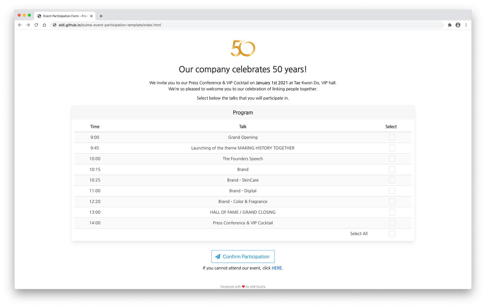

# Event Participation Template

Part of [Awesome Bulma Templates](https://github.com/aldi/awesome-bulma-templates) repo

## [Live Demo](https://aldi.github.io/bulma-event-participation-template/index.html)

## Additional Libraries used

Bulma-Checkradio - [github.com/Wikiki/bulma-checkradio](https://github.com/Wikiki/bulma-checkradio)  
Font-Awesome - [github.com/FortAwesome/Font-Awesome](https://github.com/FortAwesome/Font-Awesome)  
jQuery - [github.com/jquery/jquery](https://github.com/jquery/jquery)

## Contributing

1. Fork it!
2. Create your feature branch: `git checkout -b my-new-feature`
3. Commit your changes: `git commit -am 'Add some feature'`
4. Push to the branch: `git push origin my-new-feature`
5. Submit a pull request!

## Licence

Code released under [the MIT license](https://github.com/aldi/bulma-event-participation-template/blob/master/LICENSE).
