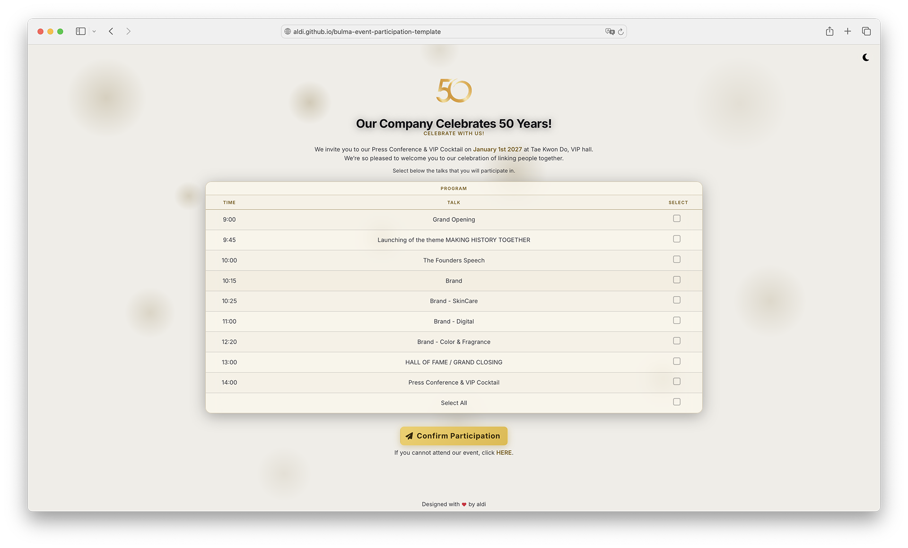
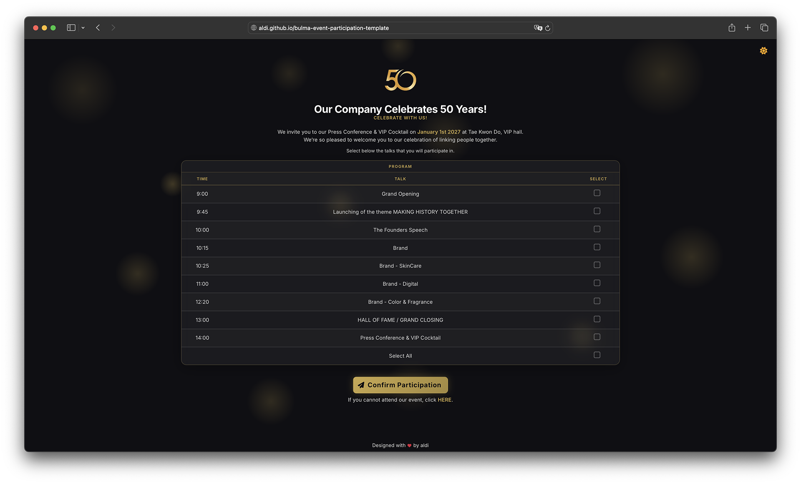

# Event Participation Template

A beautifully redesigned, modern dark-luxe event participation template featuring glassmorphism and gold accents.  
Part of the [Awesome Bulma Templates](https://github.com/aldi/awesome-bulma-templates) repo.

## [Live Demo](https://aldi.github.io/bulma-event-participation-template/index.html)

Light Mode:

Dark Mode:

## Features

- **Bulma v1 Compatible**: Built with the latest version of the Bulma CSS framework.
- **Dark-Luxe Aesthetic**: A premium dark theme featuring deep rich backgrounds and gold brand accents.
- **Glassmorphism**: Modern frosted glass effect for content panels.
- **Fully Responsive**: Adapts seamlessly to all screen sizes.

## Additional Libraries used

- [Bulma-Social](https://github.com/aldi/bulma-social)
- [Font-Awesome](https://github.com/FortAwesome/Font-Awesome)

## Licence

Released under the [MIT License](LICENSE).
